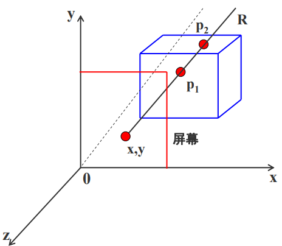

# Z-缓冲器扫描线算法
这个算法是一个消隐算法，消隐是指是指在一个景物空间中的多个物体会有批次的远近关系或者遮挡关系，需要把那些位于后面的或者被遮挡的部分隐去。
## 经典Z-buffer算法（Z缓冲器算法）
先将 Z 缓冲器中各单元的初始置设置为最小值。当要改变某个像素的颜色值时，首先检查当前多边形的深度值是否大于该像素原来的深度值（保存在该像素所对应的Z 缓冲器的单元中）。如果大于原来的 Z 值，说明当前多边形更靠近观察点，用它的颜色替换像素原来的颜色。

z-buffer算法比较p1和p 2的z值， 将最大的z值存入z缓冲器中。显然，p1在p 2前面，屏幕上（x,y） 这一点将显示p1点的颜色
```c
Z-Buffer 算法(){
    帧缓存全部置为背景色
    深度缓存全部置为最小的Z值
    for(每一个多边形){
        扫描转换该多边形
        for(该多边形在该像素的深度值Z(x,y)){
            计算该多边形在该像素的深度值Z(x,y)
            if( z(x,y) > z缓存在(x,y)的值 ){
                把z（x,y）存入 z缓存中(x,y)处
                把多边形在(x,y)处的颜色值存入帧缓存的(x,y)处
            }
        }
    }
}
```
### 算法分析
算法比较简单，也很直观，在像素级上以近物取代远物。与物体在屏幕上出现的顺序是无关紧要的，有利于硬件实现。但占用空间大（因为它开了一个和帧缓冲区一样大的空间，深度缓冲区），且没有利用图形的相关性与连续性，这是 z-buffer 算法的严重缺陷。

经典的 Z-buffer 算法，思想是开一个和帧缓存一样大小的存储空间，利用空间上的牺牲换取算法上的时间开销。还介绍了只开一个缓存变量的 Z-buffer算法，是把问题转换成判别点是否在多边形内，通过把空间多边形投影到屏幕上，判别该像素是否在多边形内。但不管是经典的 z-buffer 算法，或者是改进后的 z-buffer 算法，都是在**像素级**上处理问题，要进行消隐的时候，**每个像素都要进行计算判别，甚至一个像素要进行多次（一个像素可能会被多个多边形覆盖）**


# 可用3D模型下载网站
https://free3d.com/3d-models/obj

https://www.artec3d.cn/3d-models

https://www.cc.gatech.edu/projects/large_models/

https://www.dmi-3d.net

https://nasa3d.arc.nasa.gov/models/sort_name

https://hum3d.com/zh/free/


