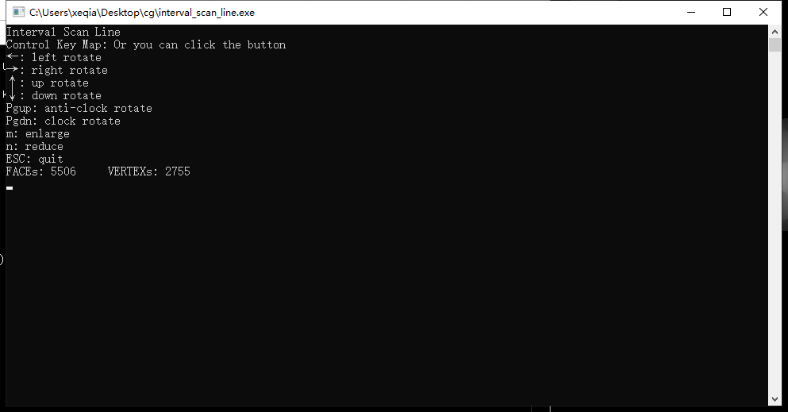
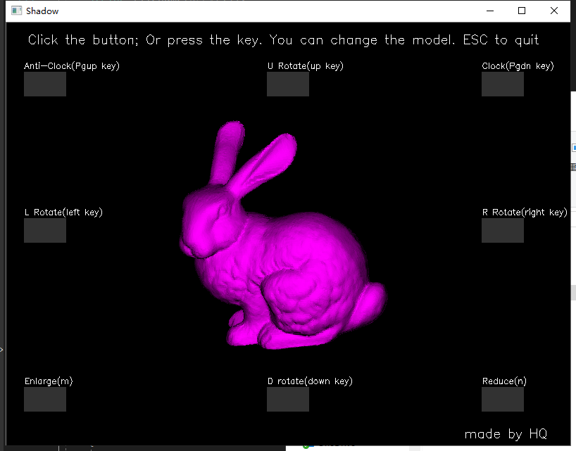
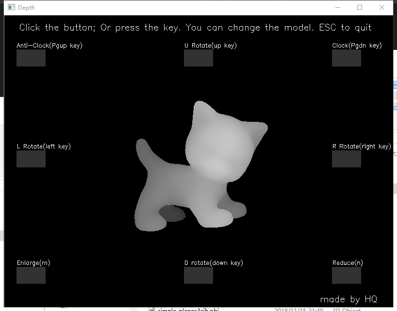

# Interval Scan Line 

## 平台环境
**操作系统**：  Win10

**IDE**: VS2017

**依赖**： opencv 


## 功能
1. 读取obj文件并展示模型
1. 显示深度图
1. 显示灯光下的阴影轮廓图
1. 支持贯穿模型和非凸模型
1. 使用上下左右和Pgup、Pgdn进行旋转，按m放大，按n缩小。同时点击图像中的按钮也可以控制
1. 显示读取和绘制时间

## 特点
1. 使用区间扫描线算法
1. 得出数据后，使用简单的opencv进行画图
1. 使用集合InOrOut记录在当前区间的图形id，取代IPT的flag
1. 将所有图形用PT存，不设IPT，可以通过id随机访问
1. AET中，记录所有在当前扫描线上的边，以x1为序

## 使用方法
在命令行中输入 "programname.exe modelname.obj"

如：
```
interval_scan_line example.obj
```
或直接把模型文件拖动到程序文件上。

## 注意
本项目包含了一些文件，在已有环境下可以直接调试运行，不需要多余的项目配置

若项目在VS中无法生成，尝试右击项目，重定向项目

另确保环境变量path里包含opencv_world400d.dll及opencv_world400.dll所在目录，或者这两个文件与程序同目录，否则无法运行。

## 算法过程
```
img = imgDepth = Null
buildPT
buildET
for y = height -> 0
    z_buffer = Null
    InOrOut = Null
    updateAET
    if AET.size == 0
        continue
    e1 = AET.first
    while (e1 != AET.end)
        changeInOrOut(e1.polyId)
        e2 = AET.next
        calImg(e1.x, e2.x, y, z_buffer)
        e2 = e1
    end while
endl for
```

```
void calImg(x1, x2, y, z_buffer)
{
    poly1 = closest poly which id in InOrOut at (x1,y)
    poly2 = closest poly which id in InOrOut at (x2,y)
    if (poly1 == poly2)
        update(z_buffer, x1, x2, y)
    else
        through_x = x of poly1 and poly through
        update(z_buffer, x1, through_x, y)
        update(z_buffer, through_x, x2, y)
    update img and imgDepth
}
```

## 使用模型
使用的部分模型数据如下表：

|No|Name|Faces|Vertex|Load Time(ms)|Render Time(ms)|
|---|:---|---|---|---|---|
|1|bunny|69664|34834|289|289|
|2|cat|5506|2755|58|31|
|3|cube|6|8|2|3|
|4|flowers|4061|7608|147|65|
|5|nonconvex|1|9|2|1|
|6|planes|2|6|1|0|
|7|teapot|2464|1292|50|17|
|8|torusknot|2880|1440|349|27|
|9|venus|69664|34834|541|86|

## 效果


